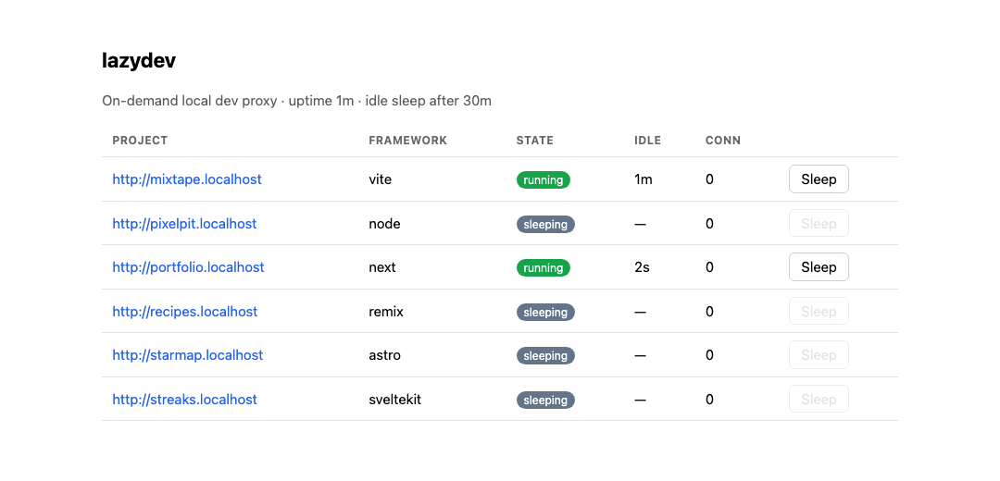

# lazydev

A local proxy that starts dev servers on demand behind permanent URLs.

You have ten projects. Each has a dev server that grabs a port and eats RAM whether or not you're using it, so you either keep fifteen terminal tabs alive or keep restarting things and guessing which port is which. lazydev's deal: every project gets a permanent URL, `http://portfolio.localhost`, and the server behind it runs only while you're actually using it.

```
$ npx @jbitar/lazydev
lazydev: scanning for projects...

  HOST       PORT  FRAMEWORK  STARTCMD     DIR
  mixtape    3010  vite       pnpm dev     ~/code/mixtape
  portfolio  3020  next       pnpm dev     ~/code/portfolio
  starmap    3030  astro      npm run dev  ~/code/starmap

lazydev is serving the front door on :4000 (:80 was unavailable, using :4000).

your projects:
  http://mixtape.localhost:4000
  http://portfolio.localhost:4000
  http://starmap.localhost:4000

dashboard: http://lazydev.localhost:4000
```

<!-- gif: record `npx @jbitar/lazydev` in a terminal, then visit a sleeping project in the browser. the tab spins a few seconds while the server boots, then the app appears. ~10s with QuickTime or Kap, crop to terminal + browser. -->

The dashboard at `http://lazydev.localhost`:



## How it works

You open `http://portfolio.localhost`. Addresses ending in `.localhost` reach your own machine by web standard, no /etc/hosts edits, no DNS tools, so the request lands on lazydev, which reads the host name and looks `portfolio` up in its registry: one JSON file of name, folder, port, start command.

If portfolio's server is running, the request is piped straight through and you never notice lazydev was there. If it's asleep, you get an instant page with a spinner while lazydev runs the project's start command; the moment the port answers you're handed to the real app, no manual reload. A Next app cold-starts in about 8 seconds on my machine, timed with curl. Thirty minutes after the last request, the server is killed and its RAM freed. The URL keeps working; the next visit wakes it again.

Sleeping a project kills the whole process tree (pnpm, the framework under it, its workers), not just the top pid. WebSockets are piped raw, so hot-module reload works through the proxy. `tenant.myapp.localhost` routes to `myapp` with the Host header intact, so multi-tenant apps still see their subdomain. And a dev server you started yourself in a terminal gets adopted, not fought.

`npx @jbitar/lazydev` scans your home directory for projects with a `dev` script, assigns each a free port, and serves in the foreground until Ctrl-C. All state lives in `~/.local/state/lazydev`; nothing touches your project folders, and deleting that one directory removes every trace. Anything the scan can't see (a static folder, a Python server) is one JSON entry in the registry.

## The persistent install

The npx run serves on :4000, so URLs carry the port. Installing gets you the portless URLs and survives reboots. macOS, Node 20+, and Caddy (`brew install caddy`):

```bash
git clone https://github.com/joudbitar/lazydev ~/lazydev
~/lazydev/install.sh
lazydev scan
```

This loads a LaunchAgent that keeps the daemon alive, puts Caddy on :80 as the front door, and links a CLI onto your PATH. No sudo anywhere; `uninstall.sh` puts everything back.

```
lazydev              status table: every project, URL, state, idle time, port
lazydev open <x>     wake <x> and open it in the browser
lazydev sleep <x>    stop <x> now instead of waiting for the idle timer
lazydev logs <x> -f  tail <x>'s dev-server output
lazydev scan         find new projects and register them
lazydev dash         the status table as a web page, at http://lazydev.localhost
lazydev restart      bounce the daemon
```

## How it's built

The daemon is one Node file with zero npm dependencies: router, reverse proxy, process supervisor, and idle reaper in about 2,000 lines of built-ins.

- Everything is loopback-only and fails closed: requests from off the machine get a 403, and the control plane requires a token the daemon mints at boot. Who serves :80 differs per platform; the reasoning is in [docs/adr/0001-npx-front-door.md](docs/adr/0001-npx-front-door.md).
- Health probes try `127.0.0.1` and `::1` separately, because plenty of dev servers listen on one family only.
- `scan` merges instead of overwriting, so a rescan never clobbers the port or start command you fixed by hand.

## What it doesn't do

- Portless URLs from npx alone; a listener on :80 means the Caddy install on macOS or CAP_NET_BIND_SERVICE on Linux. `npx @jbitar/lazydev` runs fine on Linux, but the installer is macOS launchd; a systemd port is the PR I'd merge first.
- https, yet. The installed path is a Caddy config line away.
- Anything except dev servers. Databases, Docker, queues, and tunnels are out of scope, and stopping idle servers is the opposite of what a production process manager wants.

## Alternatives

[hotel](https://github.com/typicode/hotel) proved people want this (10k stars) and then went quiet; it starts servers on access but never stops them. [chalet](https://github.com/jeansaad/chalet) is its maintained fork, same model. [puma-dev](https://github.com/puma/puma-dev) has real wake and sleep but is built around Rails and installs its own DNS resolver. [rpx](https://github.com/stacksjs/rpx) is the closest living tool, part of the Stacks ecosystem. Use lazydev if you want a permanent URL for every project, your RAM back, and a codebase you can read in one sitting.

## License

MIT
